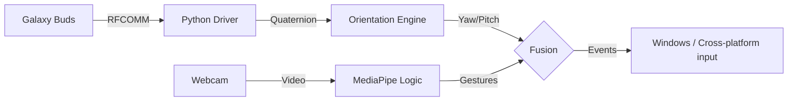

# Galaxy Buds 4D Spatial Head Tracking (Windows-focused runtime)


This project reverse-engineers the Bluetooth RFCOMM protocol of **Samsung Galaxy Buds (Pro/2/3)** to access **6-DoF IMU data** in real time for visualization and hands-free input.

## Important platform note

- **Mouse/gesture control is now implemented with cross-platform `pyautogui`** and works on Windows environments.
- **The Buds transport layer (`buds/connection.py`) still depends on Apple `IOBluetooth`**, so full end-to-end Buds streaming is not yet native on Windows.

If you want true Windows-native Buds transport, the next step is replacing `buds/connection.py` with a Windows Bluetooth RFCOMM backend.

## Features

- Real-time quaternion tracking pipeline.
- 3D visualization with webcam overlay.
- Head-controlled cursor movement.
- Hand-gesture click/drag controls via MediaPipe.

## Requirements

- Python 3.9+
- Samsung Galaxy Buds (for sensor streaming)

## Installation

```bash
git clone https://github.com/fiqgant/galaxy-buds-head-tracking.git
cd galaxy-buds-head-tracking
pip install -r requirements.txt
```

## Usage

```bash
python main.py
```

Modes:
1. Terminal output
2. 3D visualization
3. Mouse control
4. CSV logging

## Architecture



## License

MIT
